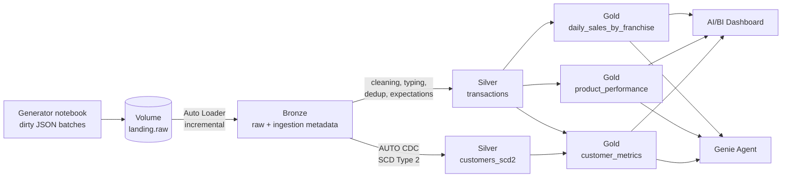
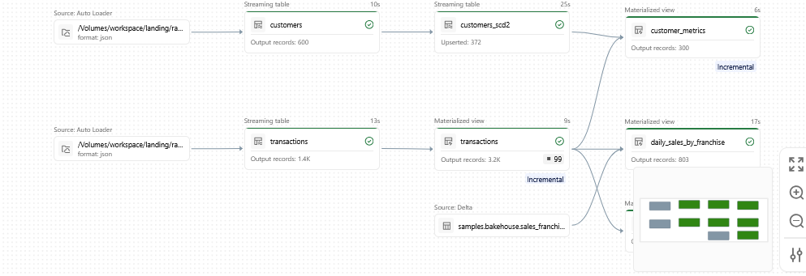
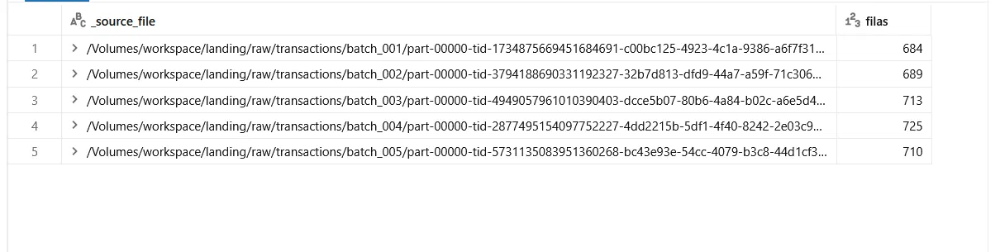
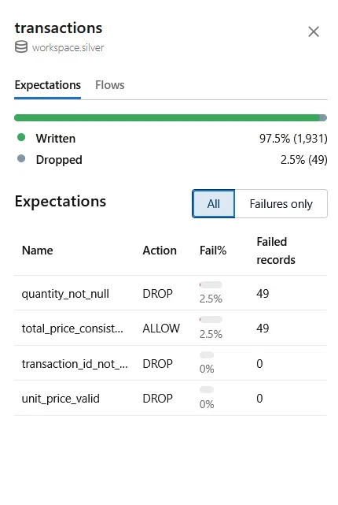
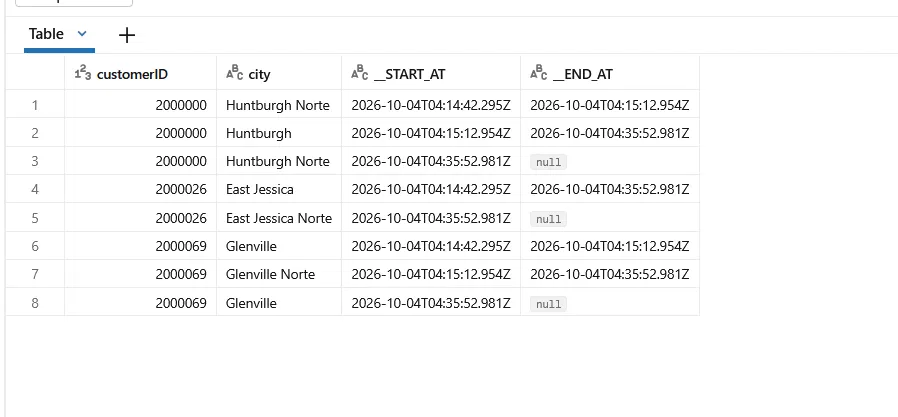
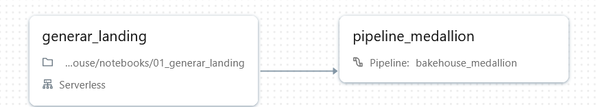
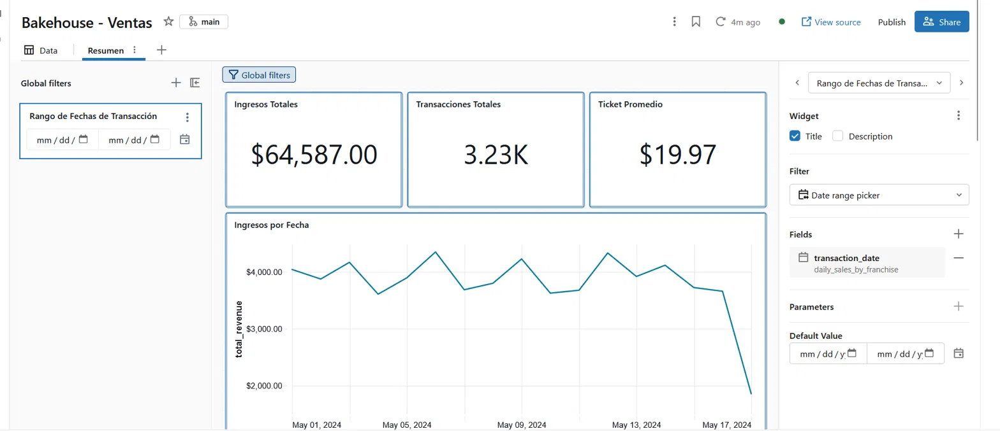
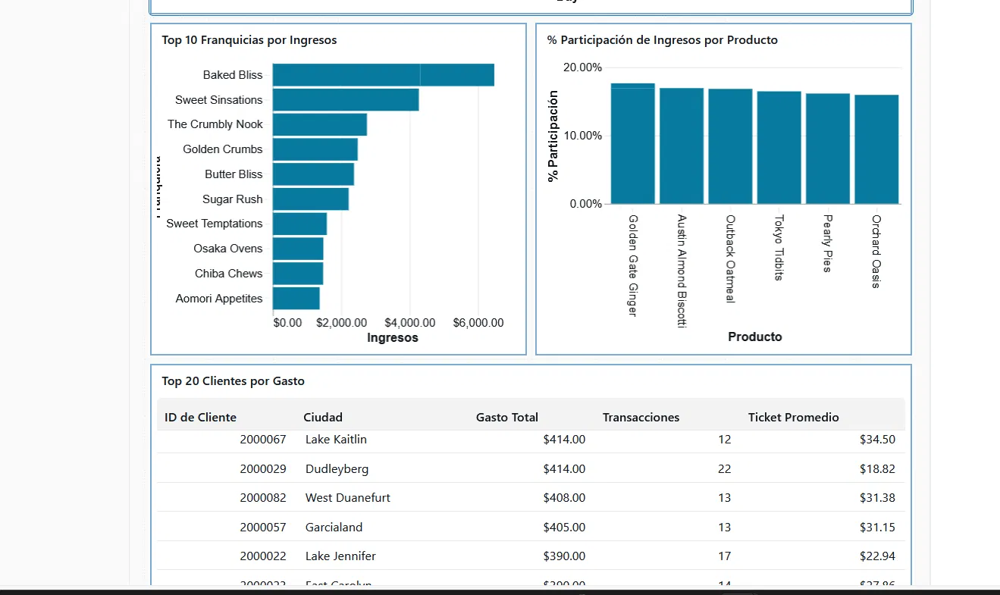
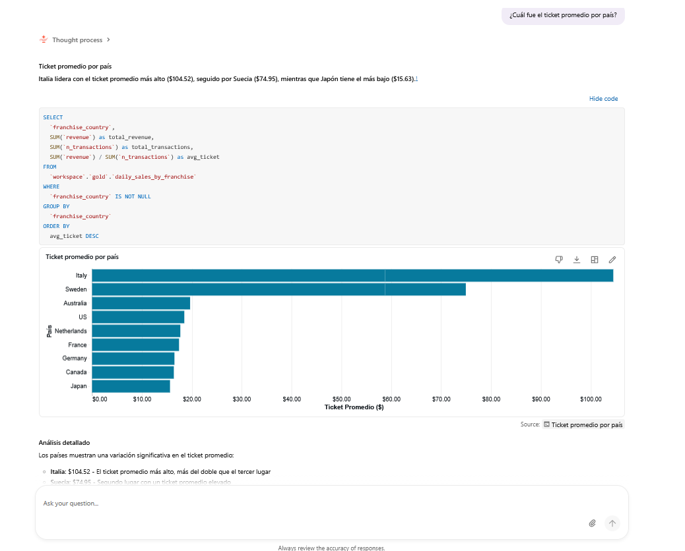
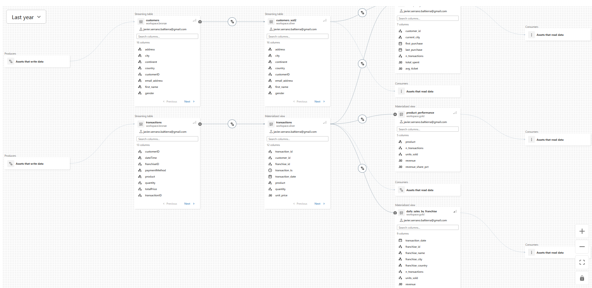

# Databricks Medallion Pipeline — Bakehouse Sales

End-to-end data pipeline on Databricks implementing the **medallion architecture** (bronze / silver / gold), from incremental file ingestion to self-service analytics with AI/BI and Genie.

Built on **Databricks Free Edition** (serverless compute) as a hands-on project to apply Databricks lakehouse concepts.

---

## Architecture



Orchestrated by a **Lakeflow Job** (generator → pipeline) on a daily schedule. Governed end-to-end by **Unity Catalog**.



---

## Tech stack

| Area | Tools |
|---|---|
| Ingestion | Auto Loader (`read_files` streaming), Unity Catalog Volumes |
| Transformation | Lakeflow Declarative Pipelines (SQL), streaming tables, materialized views |
| Data quality | Pipeline expectations (`DROP ROW` and warn-only) |
| History | `AUTO CDC` with SCD Type 2 |
| Orchestration | Lakeflow Jobs (multi-task, scheduled) |
| Governance | Unity Catalog: schemas, comments, table and column-level lineage |
| Consumption | AI/BI Dashboard (built with Genie Code), Genie Agent |
| Version control | Databricks Git folders + GitHub |

---

## How it works

### Landing — simulated source system
A generator notebook writes a new batch of JSON files on each run, using the `samples.bakehouse` dataset. It injects realistic data issues on purpose: duplicates (~5%), null quantities (~3%), prices as strings with comma decimals, and customer attribute changes between batches. It auto-detects the next batch number, so the job runs unattended. Sensitive data (card numbers) is dropped before landing.

### Bronze — faithful raw copy
Streaming tables ingest only new files using Auto Loader. Each row keeps its source file and ingestion timestamp for traceability.



### Silver — clean and validated
- **Transactions:** typed columns, normalized prices (`3,50` → `3.50`), deduplicated by `transaction_id`, validated with expectations.
- **Customers:** full change history with SCD Type 2 via `AUTO CDC`. History is tracked only on real attribute changes, not on snapshot timestamps (`TRACK HISTORY ON * EXCEPT (updated_at)`).





### Gold — business models
| Table | Grain | Use |
|---|---|---|
| `daily_sales_by_franchise` | day × franchise | Revenue trends, franchise ranking |
| `product_performance` | product | Product mix and revenue share |
| `customer_metrics` | customer | Frequency, spend, current city (from SCD2) |

### Orchestration
A two-task job runs the generator and then the pipeline, scheduled daily. The job definition is versioned in `jobs/`.



### Consumption
**AI/BI Dashboard:** generated with Genie Code from a natural language prompt, then reviewed and corrected (sorting, and a percentage scale bug where an already 0–100 metric was multiplied by 100 again).




**Genie Agent:** natural language Q&A over the gold layer. It is configured with business instructions so it computes metrics correctly, for example average ticket as `SUM(revenue) / SUM(n_transactions)` instead of averaging pre-computed averages.



### Lineage
Unity Catalog traces the full flow automatically, at table and column level.



---

## Design decisions

- **Incremental by default:** bronze uses Auto Loader, so each run processes only new files. Re-running the pipeline without new data costs almost nothing.
- **Quality rules with intent:** invalid rows are dropped (`DROP ROW`), while consistency checks only record metrics (warn-only), so data isn't lost to soft rules. Note: in expectations, a `NULL` result counts as a failure.
- **Dedup in silver, not bronze:** bronze stays a faithful record of what the source sent. Re-sent records are absorbed downstream.
- **Reference data read directly:** franchises are static reference data, so gold joins them from the source catalog instead of routing them through landing.
- **AI-assisted, human-reviewed:** Databricks Assistant and Genie Code sped up development. All generated output was reviewed and corrected.

---

## Repository structure

```
├── notebooks/
│   ├── 00_setup                # Unity Catalog schemas and volume
│   └── 01_generar_landing      # batch generator with dirty data
├── pipelines/
│   ├── bronze.sql              # incremental ingestion
│   ├── silver.sql              # cleaning, expectations, SCD2
│   └── gold.sql                # business models
├── jobs/
│   └── bakehouse_medallion_job.yml
├── dashboards/                 # AI/BI dashboard definition
└── docs/                       # screenshots
```

## How to run

1. Run `notebooks/00_setup` once.
2. Run `notebooks/01_generar_landing` (`batch_id = auto`).
3. Create an ETL pipeline pointing to the `pipelines/` folder (default catalog `workspace`) and run it.
4. Create the job from `jobs/bakehouse_medallion_job.yml`, or run each step manually.

---

## Known limitations and next steps

- Cast `updated_at` to `TIMESTAMP` before `AUTO CDC`, so that `__START_AT` and `__END_AT` are typed as timestamps instead of strings.
- Make `daily_sales_by_franchise` and `product_performance` incrementally refreshable.
- Package pipeline and job as a **Databricks Asset Bundle** for CI/CD deployment across environments.
- Add column-level comments in gold, to enrich Unity Catalog and Genie context.